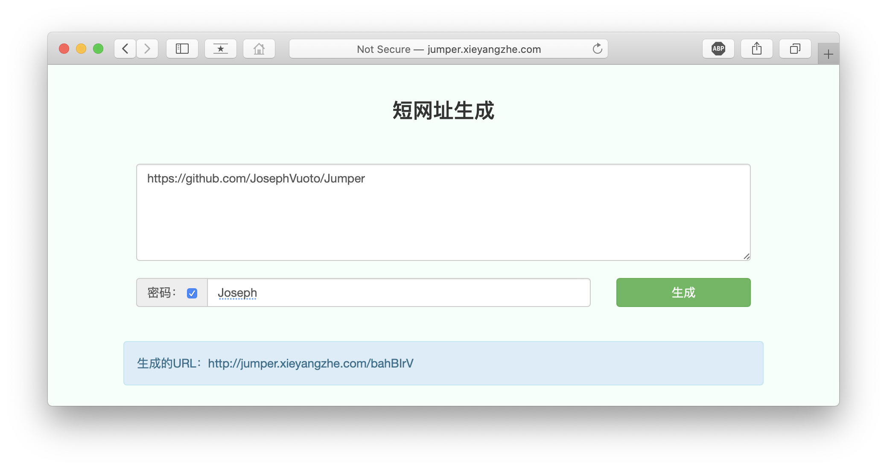
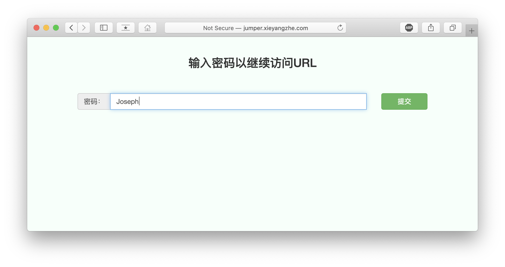

# Jumper
一个简单的短网址生成系统。
Demo地址：http://jumper.xieyangzhe.com/
## 算法
短网址很显然要尽可能短，目前主要是这几种方法
- 使用自增序列
这里采用了62进制（0-9，a-z，A-Z），因为62^7 =352161460620862，这么看来7位足够用了。这个算法的原理就是生成一个自增序列，然后转化成62进制再映射成一个字符串。如果是分布式系统也很简单，不同机器错开即可（比如两台机器，一个只生成奇数，另一个只生成偶数），因为不需要满足严格递增。
- 哈希
将长网址 md5 生成 32 位签名串,分为 4 段, 每段 8 个字节。对这四段循环处理, 取 8 个字节, 将他看成 16 进制串与 0x3fffffff(30位1) 与操作, 即超过 30 位的忽略处理。这 30 位分成 6 段, 每 5 位的数字作为字母表的索引取得特定字符, 依次进行获得 6 位字符串。总的 md5 串可以获得 4 个 6 位串,取里面的任意一个就可作为这个长 url 的短 url 地址。这样做的优点是最后生成的序列足够随机且位数固定，当然缺点也很明显，虽然概率极小，但哈希总是有可能会碰撞的。

## 一对一还是一对多？
一对一的好处是保证同一个网址每次输出的短网址都相同，坏处是如果想完美做到要额外做一个映射，非常浪费空间。如果一定追求一对一的话可以用缓存只保存比较常用的长网址，然后用LRU进行淘汰。一对多没什么好说的，简单方便。

## 301还是302？
返回301永久重定向是符合使用场景的，但是返回302的一个很重要的好处是可以对点击量和IP之类的进行保存和分析。

## 预防攻击
用Google的Guava包中的RateLimiter加Spring AOP对接口实现了一个简单的限流

## 截图

## TODO LIST
* [ ] 数据挪到Redis上
* [ ] 顺便生成个二维码
* [ ] 显示点击率
* [ ] 多弄几台机器
* [x] 基本功能实现
* [x] 做一下限流
* [x] 统计点击率
* [x] 做个缓存，用LRU淘汰